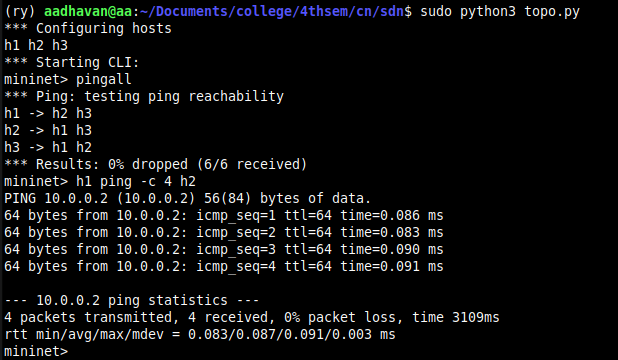
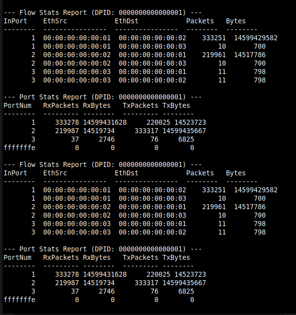
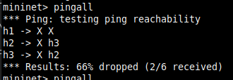
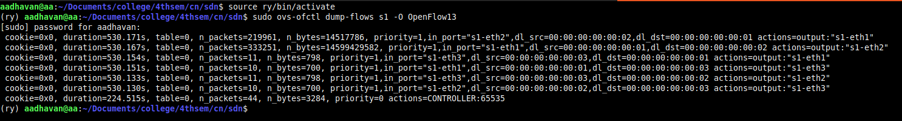

# SDN Traffic Monitoring and Statistics Collector
**Author:** Aadhavan ( paya5am ) <br>PES1UG24CS002

## 1. Problem Statement & Objective
The objective of this project is to implement a Software-Defined Networking (SDN) solution that actively collects and displays traffic statistics. The controller acts as a Layer 2 learning switch while utilizing a background thread to periodically query the switch for flow-level and port-level metrics (packet counts, byte counts), enabling real-time network observation.

**Topology Justification:** A single-switch, three-host topology was chosen in Mininet. This allows for clear isolation of variables: we can generate high throughput between H1 and H2 to observe targeted flow statistics, while leaving H3 idle as a control baseline to verify metric accuracy.

---

## 2. Prerequisites
To run this project, the following tools must be installed on your Linux environment:
* **Mininet:** For network topology emulation.
* **Ryu SDN Framework:** For the OpenFlow controller logic.
* **Open vSwitch (OVS):** The underlying virtual switch used by Mininet.
* **Python 3**
* **Wireshark:** For packet analysis and OpenFlow protocol debugging.

---

## 3. Setup and Execution Steps

To run the full demonstration, open three separate terminal windows.

**Terminal 1: Start the Ryu Controller**
Navigate to the project directory and start the monitoring application:
```bash
ryu-manager monitor.py
```

**Terminal 2: Start the mininet topology**
Deploy the custom topology linking 3 hosts to the switch:
```bash
sudo python3 topo.py
```

**Terminal 3: Switch Management**
Use this terminal to inject manual OpenFlow rules or verify the flow table:
```bash
sudo ovs-ofctl dump-flows s1 -O OpenFlow13
```

---

## 4.  Expected Output & SDN Logic

* **Packet_in Handling:** The controller intercepts unknown packets, maps MAC addresses to incoming ports, and pushes explicit OFPFlowMod match+action rules back to the switch.
* **Monitoring:** The controller uses OFPFlowStatsRequest and OFPPortStatsRequest every 10 seconds to generate periodic traffic reports in the controller terminal.
* **Functional Behavior:** The network will exhibit standard Layer 2 learning switch forwarding, firewall capabilities (blocking/dropping), and continuous real-time logging of network metrics.

---

## 5. Proof of Execution & Test Scenarios

### Scenario A: Baseline Forwarding & Latency (Allowed Case)
Normal L2 learning behavior allows all hosts to reach each other with minimal latency. 
* **Action:** Ran `pingall` and `h1 ping -c 4 h2` in Mininet.
* **Result:** `0% dropped` for all hosts. Baseline latency between H1 and H2 averages `0.087 ms`. This proves the controller successfully calculates match+action logic and installs forwarding rules.


### Scenario B: Traffic Monitoring & Throughput Load
To test the statistics collector module, a heavy traffic load was generated.
* **Action:** Ran `iperf h1 h2` in Mininet.
* **Result:** The Ryu controller logs successfully caught the throughput spike. The flow between MAC addresses ending in `...01` and `...02` shows massive packet (333,251) and byte (14.5 GB) counts, while the idle host 3 remains at a minimal 10 packets.


### Scenario C: Access Control & Filtering (Blocked Case)
To demonstrate firewall and access control capabilities, a manual security rule was injected.
* **Action:** Injected a drop rule via terminal: `sudo ovs-ofctl -O OpenFlow13 add-flow s1 priority=100,in_port=1,actions=drop`. Then ran `pingall` in Mininet.
* **Result:** The network respects the filtering rule. Host 1 is completely isolated, resulting in a `66% dropped` pingall rate, while Host 2 and Host 3 can still communicate freely.


### Scenario D: Flow Table Verification
To prove the explicit match-action rules (and the manual drop rule) reside in the switch hardware, the OVS flow table was dumped.
* **Action:** Ran `sudo ovs-ofctl dump-flows s1 -O OpenFlow13`.
* **Result:** The output clearly shows the installed OpenFlow rules mapping `in_port`, `dl_src`, and `dl_dst` to specific output actions (`actions=output:"s1-eth1"`), alongside the accumulated byte and packet counters for each specific flow.


### Scenario E: Controller-Switch Interaction
To validate the SDN communication protocol, Wireshark was used to capture traffic on the loopback interface (`127.0.0.1`).
* **Action:** Filtered Wireshark traffic for `openflow_v4`.
* **Result:** The capture clearly displays the `OFPT_PACKET_IN` / `OFPT_PACKET_OUT` learning behavior, `OFPT_FLOW_MOD` rule insertions, and the periodic `OFPMP_PORT_STATS` / `OFPMP_FLOW`, `OFPT_MULTIPART_REQUEST` / `OFPT_MULTIPART_REQUEST ` multipart requests and replies driving the statistics collector.


---

## 6. References
* [Ryu SDN Framework Documentation](https://ryu.readthedocs.io/)
* [Mininet Python API Reference](http://mininet.org/api/)
* [Open vSwitch Manual](https://www.openvswitch.org/support/)
